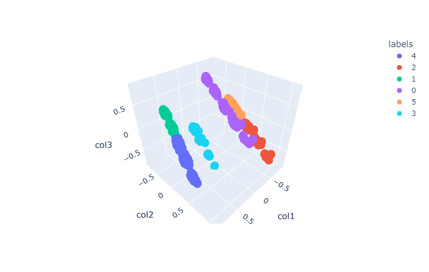
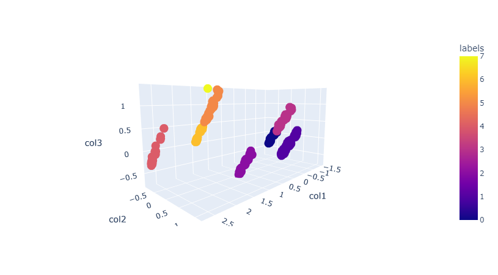
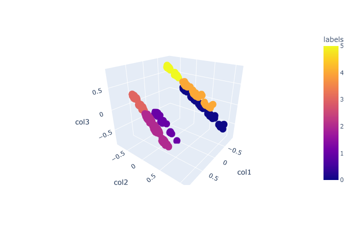
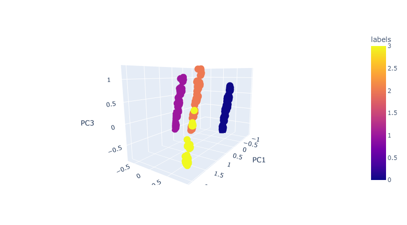
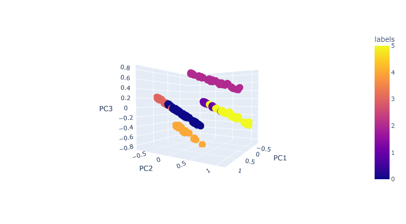

# Customer-Segmentation
This project has been created to make a customer segmentation and it's part of a challenge called [Project-of-the-week](https://github.com/DataTalksClub/project-of-the-week/blob/main/2022-08-31-clustering.md) that is being held by [Datatalks.club](https://datatalks.club/slack.html).
# Enviroment
I'll create a conda enviroment for this project
## Create the enviroment
```
conda create -n customer-segmentation python=3.9
```
## Activate the enviroment
```
conda activate customer-segmentation
```
## Install Ipykernel
```
pip install ipykernel
```
## Install the dependencies
```
pip install -r requirements.txt
```
# Clusters
## K-Means
[Code](notebooks/1_Kmeans.ipynb)
-   For KMeans the best way to find the best number of clusters is using the elbow method, in this case we can see that the best number of clusters is 4-7.
-   Using KElbowVisualizer we can see that the best number of clusters is 4.
-   Using Silhouette Score we can see that the best number of clusters is 6-7.
-   Because of the previous results I'll select 6 clusters.
-   Silhouette Score is 0.43

## Hierarchical:Meanshift
[Code](notebooks/2_Hierarchical.ipynb)
-   For Hierarchical:Meanshift it wasn't neccesary to find the best number of clusters because of estimated_bandwidth function.
-   It's performed better using PCA.
-   Using PCA found 8 clusters, but the data concentrated in 6 clusters.
-   Silhouette Score is 0.87.

## Hierarchical:Agglomerative
[Code](notebooks/3_Hierarchical_Agglomerative.ipynb)
-   It's performed better using PCA (n_clusters=6).
-   Silhouette Score is 0.82.

## Hierarchical:DBSCAN
[Code](notebooks/4_DBSCAN.ipynb)
-   Most important parameters are eps and min_samples.
-   You can find a good value for eps using NearestNeighbors function.
-   It found 4 clusters.
-   Silhouette Score is 0.58 (0.68 after PCA).

## Gaussian Mixture Models and EM
[Code](notebooks/5_Gaussian_mixture_models_and_EM.ipynb)
-   It's performed better using PCA (n_components=3), silhouette score is 0.65.



